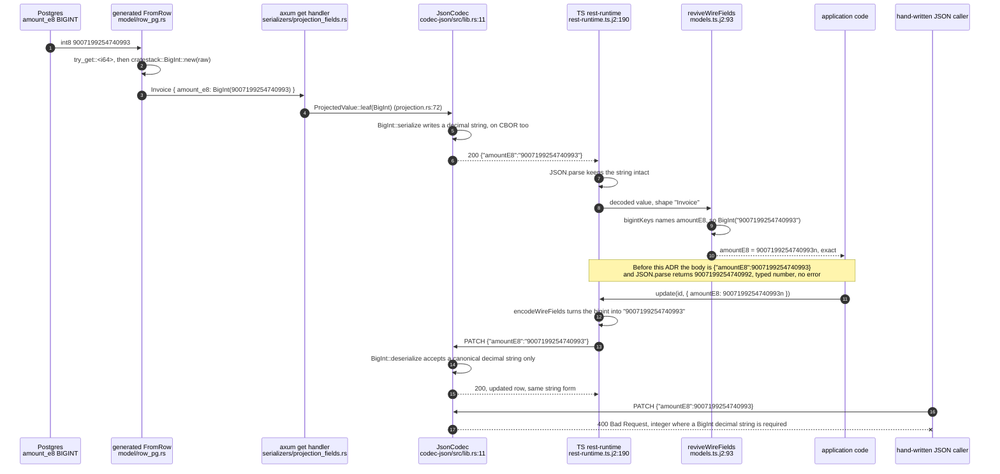
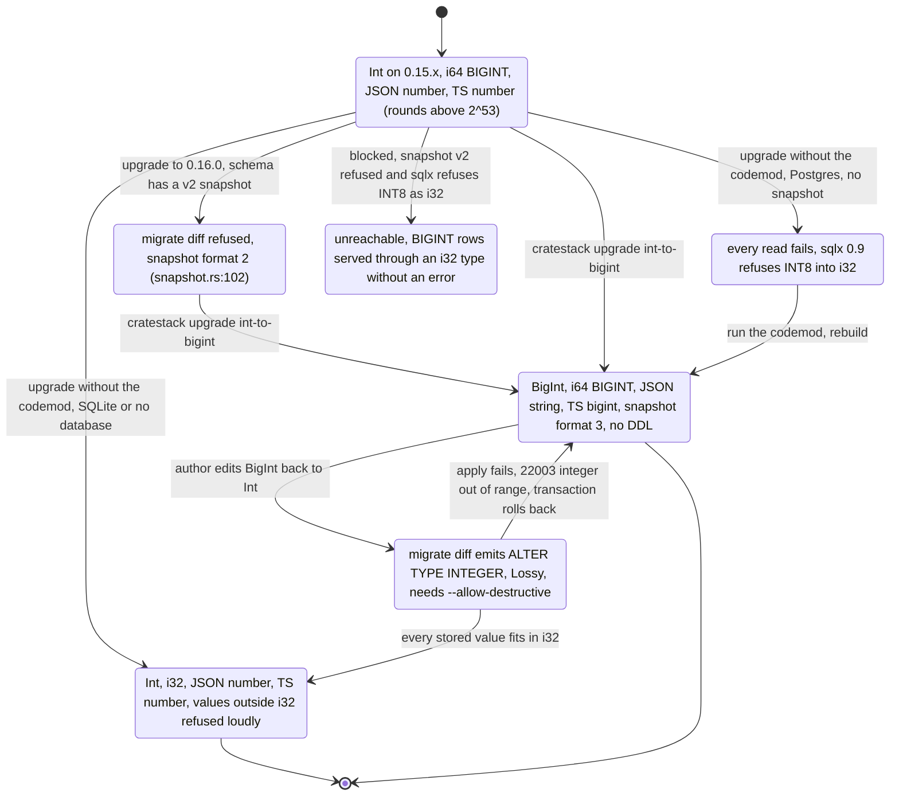

# `Int` and `BigInt`: 32-bit and 64-bit integers on every surface

Status: **accepted** (2026-09-30, by the maintainer), the design behind
[ADR 0019](../adr/0019-int-and-bigint-built-in-types.md). Not implemented. The ADR records the
decisions this document was waiting on: D2 (CBOR carries `BigInt` as a text string) decided
explicitly, D3 (the `cratestack::BigInt` newtype), D4 (the codemod) and D5 (closed field
attributes) accepted on the ADR's recommendations, and the release: all three pull requests of §7
ship in **0.16.0**.
Scope: every place a `.cstack` integer scalar reaches: parser, the three schema macros, the
sqlx and rusqlite runtimes, `cratestack-migrate`, both codecs, JSON Schema, MCP, the Rust,
TypeScript and Dart clients and their presets, the CBOR bridges, studio, WireMock, the contract
digests, the LSP and the VS Code grammar.
Tracking: ADR 0019; the field-attribute half is [cratestack#679](https://github.com/cratestack/cratestack/issues/679)'s
option (a), decided in ADR 0019 D5, which supersedes the narrow route #679 took for field
attributes.

**Evidence convention.** Every `path:line` below was READ on `origin/main` at `67100917`
(v0.15.1). `main` has since moved to `4c7e25cb` (#1127); lines in `client_contract.rs`,
`schema_identity.rs`, `rest-runtime.ts.j2` and `rpc-runtime.ts.j2` shift there, and the
implementing PRs re-anchor. Every behaviour marked RAN was executed for this document; the
command and its output are in §9, keyed `E1` to `E12`. Upstream library claims are READ from the
linked source on 2026-09-30. Nothing here is a claim about CI.

## 1. What is wrong today

A schema `Int` is a Rust `i64` with no serde attribute (`crates/cratestack-macros/src/shared/types.rs:34`,
`shared/wire_types.rs:49`, `procedure/type_tokens.rs:26` and `:96`), stored as `BIGINT`
(`crates/cratestack-migrate/src/emit/postgres/columns.rs:270`) and written by plain `serde_json`
(`crates/cratestack-codec-json/src/lib.rs:11`) as a JSON number with every digit (RAN, E5). JSON
Schema advertises the full `i64` range (`crates/cratestack-macros/src/json_schema/scalar.rs:66`,
`:111-113`).

Every JavaScript and dart2js consumer then parses that number into an IEEE double:

- The TypeScript client types `Int` as `number` (`crates/cratestack-client-typescript/src/types.rs:48`,
  `templates/src/models.ts.j2:379`) and parses with `JSON.parse`
  (`templates/src/rest-runtime.ts.j2:190`, `templates/src/rpc-runtime.ts.j2:73`).
  `JSON.parse('{"amountE8":9007199254740993}')` yields `9007199254740992`, with no error (RAN, E6).
- The Dart client types `Int` as `int` (`crates/cratestack-client-dart/src/dart_types.rs:38`) and
  decodes `(expr as num).toInt()` (`src/wire_decode.rs:113`). That is exact on the Dart VM and on
  dart2wasm, and rounds on dart2js, where `jsonDecode` and even `int.parse` give
  `9007199254740992` (RAN, E7).
- On CBOR the value is a native integer (major type 0/1, RAN, E5). `@cratestack/cbor-node` returns
  a JS `number` up to 2^53 - 1 and a `bigint` above it
  (`crates/cratestack-cbor-napi/src/js_value/napi_conversions.rs:99-106`, READ), so one field
  arrives as two JS types depending on its value. `@cratestack/cbor-web` builds a default
  `serde_wasm_bindgen::Serializer` (`crates/cratestack-cbor-wasm/src/wasm.rs:86-88`), whose
  `serialize_i64` returns an error outside the safe range (serde-wasm-bindgen 0.6.5
  `src/ser.rs:329-346`, READ), so the whole response fails to decode in the browser.

Above 2^53 (90,071,992.54740991 XAF at skyport-billing's e8 scale) roughly half of all values,
then three quarters, then seven eighths, and so on, round silently in the portal. A whole-franc
amount happens to survive because it is a multiple of 2^8; any amount with a sub-franc part does
not (RAN, E6).

There is no per-field escape. An author who writes `amountE8 Int @string` or `@wire(string)` gets
`schema OK` and a generated `amountE8: number`; the attribute changes nothing but the whole-IR
schema digest (RAN, E1, E4). ADR 0019 D5 closes that hole.

## 2. The wire contract

| | `Int` | `BigInt` |
|---|---|---|
| Range | `i32`: -2,147,483,648 to 2,147,483,647 | `i64`: -9,223,372,036,854,775,808 to 9,223,372,036,854,775,807 |
| Rust | `i32` | `cratestack::BigInt` (a `Copy` newtype over `i64`, §3.2) |
| Postgres | `INTEGER` (`int4`) | `BIGINT` (`int8`) |
| SQLite | `BLOB` affinity, stored as an SQLite integer (`emit/sqlite/columns.rs:89`, unchanged) | same |
| JSON | a JSON number | a JSON string holding the canonical decimal form |
| CBOR | major type 0/1 integer | major type 3 text string, the same canonical decimal form |
| JSON input | a JSON integer in range; `1.0`, `3000000000` and strings are refused | a canonical decimal string in range; a JSON number is refused |
| CBOR input | an integer in range | a canonical decimal text string in range; a CBOR integer or a bignum (tag 2 or 3) is refused |
| JSON Schema | `{"type":"integer","minimum":-2147483648,"maximum":2147483647}` | `{"type":"string","pattern":"^(0\|-?[1-9][0-9]{0,18})$"}`, the `i64` bound enforced by the server only |
| TypeScript | `number` | `bigint` |
| Dart | `int` (exact on VM, dart2js and dart2wasm) | `BigInt` from `dart:core` |
| Filters | `NumberFilter` (TS, Dart) | `BigIntFilter` = `ComparableFilter<bigint>` (TS), `ComparableFilter<BigInt>` (Dart) |

**Canonical decimal form.** `0`, or an optional `-` followed by a non-zero digit and at most 18
more digits, with the value inside `i64`. `+5`, `007`, `-0`, `" 1"` and `9223372036854775808` are
refused with a message naming the field (prototype RAN, E5). The emitted form is `i64`'s
`Display`, so every value the server writes is canonical.

**Why a JSON number is refused for `BigInt`.** A number above 2^53 that arrives at the server
may already have been rounded by a JavaScript producer, and the server cannot tell. Refusing it is
the fail-closed answer, and it is the rule `Decimal` already follows: `rust_decimal` with
`serde-str` (root `Cargo.toml:405`) refuses a JSON number (`scalar.rs:38-41`, RAN, E5).

**The CBOR form, decided.** The maintainer decided this on 2026-09-30, in substance: CBOR is the
primary codec for these projects, so a decision for it is mandatory, and `BigInt` as a string is
fine (ADR 0019 D2). A `BigInt` is a CBOR text string (major type 3,
[RFC 8949 §3.1](https://www.rfc-editor.org/rfc/rfc8949#section-3.1)) holding the canonical decimal
form above, with the same grammar and the same rejection rules as JSON: no leading `+`, no leading
zeros, no `-0`, no number form accepted, range-checked to `i64`. `i64::MAX` is the initial byte
`0x73` and 19 ASCII digits, where today's `Int` is `1b7fffffffffffffff` (RAN, E5).

**Why the same string on CBOR, and not a native integer.** Three reasons, each READ in the tree:

1. `POST /rpc/batch` carries every frame's input and output as `serde_json::Value`
   (`crates/cratestack-core/src/rpc.rs:107`, `:118`). Any encoding that branches on
   `is_human_readable()` takes the JSON branch there and then lands on CBOR as that JSON form, the
   `Uuid` defect `ProjectedValue` was built to avoid on the unary path
   (`crates/cratestack-axum/src/projection.rs:1-17`). A string on both codecs has no branch to take
   (prototype RAN through `serde_json::Value` then CBOR, E5).
2. The `cratestack_cbor` Dart codec, the default (`crates/cratestack-client-dart/src/config.rs:17`),
   crosses a JSON-text boundary on both its platforms
   (`dart-packages/cratestack_cbor/lib/src/cbor_codec.dart:17-31`), and on the web that text goes
   through JS `JSON.parse`/`JSON.stringify` (`lib/src/web/web_cbor_codec.dart:75`, `:95`), which
   rounds a large number token and throws on a JS `bigint`. A string survives both.
3. The two JS bridges disagree about large integers today (§1): `@cratestack/cbor-node` returns a
   `number` or a `bigint` by magnitude, `@cratestack/cbor-web` refuses to decode. A string needs
   neither changed.

`Decimal` is already a text string on CBOR (`crates/cratestack-client-flutter/src/cbor/mod.rs:48-49`,
RAN: `rust_decimal` `1.50` encodes as `64312e3530`, E5), so the shape is not new.

**Why not an RFC 8949 bignum (tag 2 or 3).**
[§3.4.3](https://www.rfc-editor.org/rfc/rfc8949#section-3.4.3) defines bignums for integers that do
not fit major types 0 and 1, and its preferred serialization never uses one for a value that does;
every `i64` fits. A tagged byte string would be a second, non-preferred spelling of a number that
already has a native form, and the RFC's security considerations
([§10](https://www.rfc-editor.org/rfc/rfc8949#section-10)) warn that a decoder in the basic data
model gives the two spellings different semantics. Accepting both is the parallel path the
maintainer's rule excludes; emitting only the tag makes every value non-preferred. It also has
nowhere to go: a `serde_json::Value` frame and the Dart JSON-text boundary carry no tag, and both
JS bridges decode into `cratestack_core::Value`, which is `Null`, `Bool`, `Int(i64)`, `Float`,
`String`, `Bytes`, `List` and `Map` and nothing tagged (`crates/cratestack-cbor-wasm/src/wasm.rs:16`,
`crates/cratestack-cbor-napi/src/js_value/napi_conversions.rs:50`,
`crates/cratestack-core/src/value.rs:20-29`, READ). RFC text READ on 2026-09-30.

**The consequence: one wire form on every codec.** A value decodes identically whichever codec a
client negotiates, and no client needs a codec-specific branch for it. The cost is size: `i64::MAX`
is 20 bytes as CBOR text against 9 as a CBOR integer (E5 prints the frame lengths). ADR 0019
records native CBOR integers and bignum tags as rejected alternatives and names what would have to
change first: the batch frames, the Dart JSON-text boundary and the bridges' value model, in an ADR
that supersedes D2.

## 3. Per-target changes

"Now" is READ at `67100917`. "After" is this design.

### 3.1 Parser, LSP, editor

| Area | Now | After |
|---|---|---|
| Built-in names | `BUILTIN_TYPES` (`crates/cratestack-parser/src/validate/type_names.rs:7-24`) has `Int`, not `BigInt` | adds `BigInt`; a user `type`/`model`/`enum` named `BigInt` becomes a duplicate-name error (`type_names.rs:26-67`, `:69-79`). None exists in the 273 committed schemas or the five downstream ones (RAN, E10, E8) |
| `@version` | must be a required `Int` (`validate/model_attributes.rs:192`) | a required `Int` or `BigInt` |
| `@range` | `Int` or `Decimal` only (`validate/validators.rs:83`), bounds parsed as `i64` (`validate/validator_args.rs:26`) | adds `BigInt`; on `Int`, a bound outside `i32` is a parse error |
| `query` bind parameters | `BINDABLE_ARG_TYPES` has `Int` (`validate/query_signature.rs:35-37`) | adds `BigInt` |
| LSP completion | built-ins read from the parser (`crates/cratestack-lsp/src/completion.rs:62`) | nothing to do; `BigInt` appears |
| VS Code grammar | a hand-written list (`packages/cratestack-vscode/syntaxes/cstack.tmLanguage.json:83`) that already lacks `Decimal`, `Vector`, `Geography`, `Geometry` | adds `BigInt` and the four missing names |
| Field attributes | near-miss only (`validate/misspelled_attributes.rs:213-240`) | a closed list per declaration kind, §5 |

### 3.2 The Rust surface (server, embedded, client macros)

`cratestack::BigInt` lives in `cratestack-core` (zero workspace dependencies, so it is visible to
all four facades) with `Serialize` writing `collect_str` and `Deserialize` taking a canonical
string only; the prototype in §9 E5 is the whole of the serde part. It is `Copy`, `Eq`, `Ord`,
`Hash`, `Default`, `Display`, `FromStr`, `From<i64>` and `From<BigInt> for i64`, and exposes
`new`/`get`. Arithmetic is checked methods only (`checked_add`, `checked_sub`, `checked_mul`, each
returning `Option<BigInt>`; PR B fixes the final list): there are no `Add`, `Sub`, `Mul` or `Neg`
operator impls, which would have to panic, wrap or invent an error path on a 64-bit money value,
and no `Deref`, which would let `i64` methods and `&BigInt` to `&i64` coercions keep compiling at a
call site nobody updated. The rationale is that a missed call site becomes a compile error instead
of silent precision loss. The name stays (decided, ADR 0019 D3): it is namespaced and matches the
schema type, and the rustdoc says it is 64-bit, not arbitrary precision.

A newtype, not a raw `i64` with `#[serde(with = ...)]`, because the value is serialized along
paths that never see a struct field's attributes:

- `?fields=` projections serialize each field as a type-erased leaf
  (`crates/cratestack-macros/src/axum/model/serializers/projection_fields.rs:24`,
  `crates/cratestack-axum/src/projection.rs:72`);
- a bare procedure return is encoded as the value itself;
- `FieldFilterInput<T>` is generic, and `Option`/`Vec` would each need their own `with` module;
- audit snapshots are `serde_json::to_value(&record)`
  (`crates/cratestack-sqlx/src/query/write/create.rs:92`), and `@@emit` payloads serialize the
  model.

With a newtype every one of those is right by construction, and a site that still expects `i64`
is a compile error rather than a silent JSON number.

| Area | Now | After |
|---|---|---|
| Field and argument types | `Int` to `i64` (`shared/types.rs:34`, `shared/wire_types.rs:49`, `procedure/type_tokens.rs:26`, `:96`) | `Int` to `i32`, `BigInt` to `::cratestack::BigInt` |
| Postgres row decode | `row.try_get(name)?` for plain scalars (`model/row_pg.rs:87`, `:160`) | `Int`: `try_get::<i32>`; `BigInt`: `try_get::<i64>` then `BigInt::new` |
| SQLite row decode | `Int` read as `i64` (`model/row_sqlite.rs:157`) | `i32` through rusqlite's range-checked `FromSql` (rusqlite 0.40.2 `src/types/from_sql.rs:120`, `:137`); `BigInt` as `i64` |
| Bind values | `SqlValue::Int(i64)`/`NullInt` (`crates/cratestack-sql/src/values/sql_value.rs:8`, `:45`), bound at `crates/cratestack-sqlx/src/query/support/values.rs:23-25`, `:54-56` and `crates/cratestack-rusqlite/src/value/bind.rs:20` | `SqlValue::Int(i32)`/`NullInt` and `SqlValue::BigInt(i64)`/`NullBigInt`; sqlx binds `INT4` and `INT8` respectively |
| Query-string filters | `parse::<i64>()` (`shared/types.rs:133-137`) | `parse::<i32>()`; `BigInt::from_str` |
| Comparison and find-many | `Int` in `supports_comparison` (`shared/attrs.rs:11`) and `find_many_where.rs:37` | adds `BigInt`; `FieldFilterInput<i32>` and `FieldFilterInput<BigInt>` |
| Procedure-arg policy values | `Value::Int` (`shared/value.rs:44-50`) | `Int`: `Value::Int(i64::from(v))`; `BigInt`: `Value::Int(v.get())` (in-process only, never serialized to a client) |
| Policy literals | `PolicyLiteral::Int(i64)` (`crates/cratestack-policy/src/read_types.rs:14`), parsed as `i64` (`policy/model/predicates.rs:179-182`, `policy/procedure/resolver.rs:123-126`), compared at `cratestack-sqlx/src/query/support/values.rs:142`, `:151` | literal container unchanged; `BigInt` fields accepted; on `Int` a literal outside `i32` is a macro error; comparison arms for both `SqlValue` variants |
| Validators | `validate_range_i64` (`crates/cratestack-core/src/validators.rs:73`), emitted for `Int` only (`validators/emit.rs:106`) | both scalars, through `i64` |
| Auth-derived defaults | `CreateDefaultType::Int` (`model/descriptor/defaults.rs:30`, `cratestack-sqlx/src/query/support/create.rs:106`, `:145`) | `Int` and `BigInt` kinds; a `BigInt` claim is accepted as a JSON integer or a canonical string, because claims are parsed server-side by `serde_json` and never pass through a JS number (§2's single form governs the request and response codecs; an identity provider's token is not one of them) |
| `@version` seed | `SqlValue::Int(0)` at `write/create_exec.rs:72`, `write/upsert_prepare.rs:45`, `batch/create_item.rs:55`, `batch/upsert_item.rs:54` | the descriptor records the version column's scalar; the seed is `Int(0)` or `BigInt(0)` |
| `If-Match` | parsed as `i64` (`crates/cratestack-axum/src/headers/etag.rs:8`) | unchanged; compared after widening the column value |
| MCP resource keys | `ADDRESSABLE_KEYS` has `Int` (`include/mcp_gate/resources.rs:30`) | adds `BigInt` |
| `Page`/`PageInput` | `i64` counters (`crates/cratestack-core/src/page.rs:25`, `:35`, `:63`), JSON numbers | unchanged: framework types, not schema scalars; `limit` is capped at `MAX_LIST_LIMIT` (`page.rs:20`) and a row count past 2^53 is not reachable |

### 3.3 Migrations

| Area | Now | After |
|---|---|---|
| Postgres column | `"Int" => "BIGINT"` (`emit/postgres/columns.rs:270`) | `Int` to `INTEGER`, `BigInt` to `BIGINT` |
| SQLite column | every column `BLOB` (`emit/sqlite/columns.rs:89`) | unchanged; a type change is a comment (`emit/sqlite/columns.rs:47-60`) |
| Column type in the IR | `ColumnType::Scalar(String)`, the `.cstack` name (`ir/columns.rs:33-39`) | unchanged; the name's meaning changes, hence the snapshot format bump |
| Snapshot | format 2 (`snapshot.rs:43`), other versions refused (`snapshot.rs:102-108`) | format 3; a format-2 snapshot is refused with a message naming `cratestack upgrade int-to-bigint` (§4) |
| `BigInt` to `Int` | n/a | `ALTER COLUMN ... TYPE INTEGER USING (col::INTEGER)` (`emit/postgres/columns.rs:46-57`), `Lossy` (`ir.rs:93`), so `migrate diff` needs `--allow-destructive` (`crates/cratestack-cli/src/migrate/diff_cmd.rs:56`). Postgres rewrites the table under an `ACCESS EXCLUSIVE` lock ([ALTER TABLE, Notes](https://www.postgresql.org/docs/current/sql-altertable.html)) and raises `22003` `numeric_value_out_of_range` ([error codes](https://www.postgresql.org/docs/current/errcodes-appendix.html)) if a row does not fit, which aborts the migration |
| Introspection | `int8` to `Int`, `int4` unmapped (`introspect/postgres/types.rs:32`, `:53-60`) | `int4` to `Int`, `int8` to `BigInt` |
| `@range ... @db_enforce` | bounds parsed as `i64` (`convert/checks.rs:66`) | unchanged |
| `@default(autoincrement())` | emitted verbatim, cratestack#1128 | not decided here; whichever fix #1128 takes, the identity column's type follows the scalar |

### 3.4 Codecs, JSON Schema, MCP

The codecs do not change: `JsonCodec` and `CborCodec` are generic over serde
(`crates/cratestack-codec-json/src/lib.rs:10-32`, `crates/cratestack-codec-cbor/src/lib.rs:46-67`)
and `BigInt`'s own impls decide the wire form. JSON Schema: `Int` gets an `int32()` mapping at
`scalar.rs:66`; `int()` (`scalar.rs:111-113`) stays for the `Page`/`PageInput` counters
(`json_schema/parts.rs:68`, `:80-81`); `BigInt` gets the string pattern of §2, and the module doc
that lists where JSON Schema is looser than serde gains the `i64` bound. MCP tool input schemas
come from the same generator.

### 3.5 TypeScript client and presets

| Area | Now | After |
|---|---|---|
| Type | `"Int" \| "Float" => "number"` (`src/types.rs:48`) | `Int` stays `number`; `BigInt` is `bigint` (the generated `tsconfig` targets ES2022, `templates/tsconfig.json.j2:3`) |
| Filters | `NumberFilter` (`src/find_many_views.rs:41`, `models.ts.j2:379`) | adds `BigIntFilter = ComparableFilter<bigint>` |
| Revival | `WireShape` has `decimalKeys`/`bytesKeys`/`bytesListKeys` (`models.ts.j2:46-51`, built at `src/wire_shapes.rs:145`) | adds `bigintKeys`; `reviveShaped` (`models.ts.j2:115-139`) turns a string, or each string of an array, into a `bigint`, and throws on anything else at that key, because a number there means a server from before the cutover whose value may already be rounded |
| Bare procedure returns | `reviveWireScalar` kinds `decimal`, `bytes`, `bytesList` (`models.ts.j2:175-193`, `src/wire_shapes.rs:233`, `:259`) | adds `bigint` |
| Encode | `encodeWireFields` converts `Decimal` for both codecs (`models.ts.j2:288-291`) | also `typeof value === "bigint"` to `value.toString()`, for both codecs. `JSON.stringify` throws on a `bigint` (RAN, E6), so this is required, not cosmetic |
| REST query strings | an object is `JSON.stringify`d (`templates/src/rest-runtime.ts.j2:218`) | run through `encodeWireFields` first |
| TanStack Query (`^5.0.0`, `src/package_deps.rs:90-91`) | keys include the input (`packages/cratestack-adapter-tanstack-query/src/index.ts:9`); `hashKey` is `JSON.stringify` with a key-sorting replacer that passes a `bigint` through, so it throws ([query-core `utils.ts:284-295`](https://github.com/TanStack/query/blob/main/packages/query-core/src/utils.ts)) | `rpcQueryKey` and the generated `cratestackQueryKeys` encode `bigint` to its string |
| RTK Query (`^2.0.0`, `src/rtk/deps.rs:35-38`) | the default `serializeQueryArgs` has turned a `bigint` into `{ $bigint: "..." }` since reduxjs/redux-toolkit@ae838b4c (2024-04-08, [source](https://github.com/reduxjs/redux-toolkit/blob/master/packages/toolkit/src/query/defaultSerializeQueryArgs.ts)); a 2.x release older than that throws | raise the floor to the first release carrying that commit; no encoding needed |
| SWR (`^2.2.0`, `src/package_deps.rs:84-85`) | `stableHash` renders any other primitive with `'' + arg`, so a `bigint` key hashes to its digits ([`_internal/utils/hash.ts`](https://github.com/vercel/swr/blob/main/src/_internal/utils/hash.ts)) | nothing required |
| Refine | ids are `BaseKey = string \| number` (`packages/cratestack-refine/src/index.ts:58-65`) | a `BigInt` id stays the wire string, which is a `BaseKey`; the provider does not revive it |

### 3.6 Dart client and the Dart CBOR paths

| Area | Now | After |
|---|---|---|
| Type | `"Int" => "int"` (`src/dart_types.rs:38`) | `Int` stays `int`, exact on every Dart target; `BigInt` is `dart:core`'s `BigInt` |
| Decode | `({expr} as num).toInt()` (`src/wire_decode.rs:113`) | `BigInt.parse({expr} as String)` |
| Encode | passed through (`src/wire_encode.rs:73`, `:97`) | `.toString()` |
| Filters | `NumberFilter` (`src/find_many_views.rs:57`) | adds a `BigInt` filter class |
| CBOR paths | native (flutter_rust_bridge, JSON text), web (wasm, JS JSON text) and pure `package:cbor` (`crates/cratestack-client-dart/src/config.rs:3-17`) | no change; a string crosses all three unchanged |

Why not Dart `int` for `BigInt`: on dart2js an `int` is a JS double, so `jsonDecode` and
`int.parse` round `9007199254740993` to `9007199254740992` (RAN, E7). One generated type has to be
right on every target, and `BigInt.parse` is exact on the VM, dart2js and dart2wasm (RAN, E7).

### 3.7 Studio, WireMock, contract digests

- Studio: `PkCast::BigInt` for `Int` keys (`crates/cratestack-studio/src/data/model_info.rs:139`,
  `data/relations.rs:184`) becomes `PkCast::Int` (`$1::integer`) for `Int` and stays `BigInt` for
  `BigInt`; `validators.rs:119` accepts a string for `BigInt`; the UI editor
  (`crates/cratestack-studio-ui/src/editors/render.rs:43`, `payload.rs:47`) uses a text input.
- WireMock: `"Int" | "Float" => ScalarKind::Number` (`crates/cratestack-mock-wiremock/src/model_attrs.rs:98`)
  and the `0` placeholders (`model_state/fields.rs:140`, `values.rs:147`) gain a `BigInt` arm
  emitting `"0"`.
- Digests: `SCHEMA_IDENTITY_DOMAIN` (`crates/cratestack-core/src/schema_identity.rs:43`),
  `OP_CONTRACT_DOMAIN` and `CLIENT_CONTRACT_DOMAIN` (`client_contract.rs:53-55`) move from `v1` to
  `v2` (§4.3).

## 4. The cutover

### 4.1 `cratestack upgrade int-to-bigint`

One command, shipped in 0.16.0 and deleted in 0.17.0:

```text
cratestack upgrade int-to-bigint --schema <file>... [--migrations <dir>] [--check]
```

1. Parses each schema and rewrites every `TypeRef` named `Int` to `BigInt` by its `name_span`
   (the IR records one per type reference; `cratestack print-ir` shows it), in reverse offset
   order. Comments, strings, `@@sql` bodies and attribute text are never touched, because nothing
   but a type reference's span is edited.
2. Re-parses the result and refuses to write unless the IR equals the original with exactly those
   names changed.
3. For each `<dir>/*/schema.snapshot.json` (the layout `migrate diff --out-dir` writes), reads the
   format-2 snapshot, rewrites every `Scalar("Int")` to `Scalar("BigInt")`, and writes format 3. A
   format-3 snapshot is left alone, so the command is idempotent.
4. Prints every rewritten field. `--check` writes nothing and exits non-zero if anything would
   change, for CI.

The result preserves storage exactly: the snapshot and the schema both say `BigInt`, so the next
`migrate diff` emits no DDL. What changes is the wire of every former `Int`: JSON number to JSON
string, TS `number` to `bigint`, Dart `int` to `BigInt`. That is the fix, applied to every field
whose values could exceed 2^53, which the tool cannot know. Migration SQL files are not touched,
so applied-migration checksums are unchanged. `cratestack diff` classifies each rewrite as
`field_retyped`, breaking (`crates/cratestack-cli/src/schema_diff/fields.rs:77-86`), which is
correct: every client must be regenerated.

Narrowing a field back to `Int` is a separate, deliberate edit per field (§3.3), with a table
rewrite the author schedules.

### 4.2 What happens without the codemod

The state diagram in §6 draws this. With a format-2 snapshot, `migrate diff` refuses. Without a
snapshot on Postgres, every read of a former `Int` column fails: sqlx 0.9 decodes `i32` only from
`INT4` (sqlx-postgres 0.9.0 `src/types/int.rs:108-112`, `src/type_info.rs:1065-1070`, READ).
Without a database, or on SQLite, `Int` becomes `i32`: values in range keep working and values
outside it are refused loudly (serde on input, rusqlite `OutOfRange` on read). No path serves
`BIGINT` data through an `i32` type silently.

### 4.3 Digests

`client_contract.rs:17-19` says the op-contract domain moves to `v2` when the derivation rules
change. Changing what the name `Int` means is such a change: without the bump, a client generated
by 0.15 and a server built by 0.16 from the same text would share every digest while disagreeing
on the wire. The release moves all three domain tags (§3.7), so every `SCHEMA_SHA256` and every
op digest changes once, the precedent #1065 set for `SCHEMA_SHA256` in 0.15.0. Independently,
the codemod's `Int` to `BigInt` rename moves the digest of every op that reaches a rewritten field,
as #1123 designed. #1127 (binding version 2) merged on 2026-09-30 as `4c7e25cb`, after this
document's base commit: a signed request now binds its op's `contract_sha`, and a digest the
server does not accept is the unsigned `426 contract_unsupported` (`CHANGELOG.md` `## Unreleased`
on `4c7e25cb`). So after the domain move every signed client gets that `426` on every op until it
is regenerated, which is the flag day #1127 already describes. `SCHEMA_SHA256` now feeds only the
warn-only `x-cratestack-schema-sha` header; it moves too, for the same reason.

### 4.4 CHANGELOG

Three `### ` entries under `## Unreleased` in `CHANGELOG.md`, one per PR of §7: A's and C's end
`breaking`, B's is additive and C folds it into its own narrative before 0.16.0. All in the
voice of the 0.14.1 GHSA-69g4-xvcm-vm2j entry (`CHANGELOG.md:229-300`): what was measured, what
changed, what to run. The `Int` entry leads with the command and the regenerate-together
instruction from #1065. `dart-packages/cratestack_cbor/CHANGELOG.md` gets nothing: that package
does not change. Each PR fills section 9 of the PR template with the
[cratestack-docs](https://github.com/cratestack/cratestack-docs) pages it updates
(`reference/scalars.md`, `reference/field-attributes.md`, `guides/find-many.md`,
`guides/validators.md`, `guides/optimistic-locking.md`, `guides/typescript-client-generation.md`)
and the matching [cratestack-skills](https://github.com/cratestack/cratestack-skills) entries.

## 5. Field attributes become a closed list

Block attributes, procedure attributes and query attributes are already closed lists checked by
`attribute_shape::check_shape` (`crates/cratestack-parser/src/validate/attribute_shape.rs:38`;
`block_attributes.rs:58`, `:74`; `procedure_attributes.rs:31`; `query_attributes.rs:29`), all from
GHSA-69g4-xvcm-vm2j in 0.14.1. Field attributes are the one position left open: an unknown name is
refused only when it is within edit distance of a known one (`misspelled_attributes.rs:213-240`),
the option (b) chosen on #679, whose close-out said a closed set "deserves its own ticket with the
migration story it implies"
([comment](https://github.com/cratestack/cratestack/issues/679#issuecomment-5458906334)).

The change: one `Known` table per field-bearing declaration (`model`, `view`, `mixin`, `type`,
`auth`), checked through `check_shape`, so the message, the suggestion and the argument-shape rules
match every other position. The union of field attributes the readers use today is 19 names: `@id`,
`@unique`, `@default`, `@relation`, `@computed`, `@readonly`, `@server_only`, `@version`, `@pii`,
`@sensitive`, `@db_enforce`, `@email`, `@uri`, `@iso4217`, `@length`, `@range`, `@regex`,
`@rename`, and `@from` on view fields. The per-kind split is derived from each name's readers in
the implementing PR, in the table format of `block_attributes.rs:19-40`. `removed_attributes.rs`
keeps its specific messages for `@allow`, `@deny`, `@pb`, `@custom`; `misspelled_attributes.rs`
becomes the suggestion source inside `check_shape`.

The migration story #679 asked for: no field attribute outside the 19 appears in any of the 265
committed schemas that parse, or in the five downstream schemas (RAN, E9). The objection recorded
in `misspelled_attributes.rs:17-25` (no spec to derive the set from, five declaration kinds, a
too-narrow list breaks users) is answered by that census plus the reader table, which is how
GHSA-69g4-xvcm-vm2j closed the other positions.

## 6. Diagrams

The value path for a `BigInt`, after this design. Each participant cites the code it stands for.



The lifecycle of a field written `Int` before the cutover release. `Int32Silent` is the state the
design makes unreachable; its incoming edge is labelled with the two things that block it.



Backing for the transitions: the snapshot refusal is `snapshot.rs:102-108` plus the format bump
in §3.3; the codemod is §4.1; the decode failure is §4.2; the narrowing is `emit/postgres/columns.rs:46-57`,
`ir.rs:93` and `diff_cmd.rs:56`. Both diagrams were rendered with mermaid-cli 11 (RAN, E11).

## 7. Implementation plan

Three pull requests, **all shipping in 0.16.0**, one breaking release with no compatibility path
(decided, ADR 0019 Release). No release is cut between them. B and C must ship together, because a
release with `BigInt` and the old `Int` would make every hand edit from `Int` to `BigInt` a `Lossy`
`ALTER` to the same type, and would give users two upgrades instead of one. A is technically
independent of B and C, and ships in the same 0.16.0 anyway, so the first 0.16.0 a user runs
carries the closed attribute list, `BigInt` and the 32-bit `Int` at once. The workspace is at
0.15.1 and #1127 (breaking) is already under `## Unreleased`, so 0.16.0 is the next minor.

**PR A. Field attributes are a closed list** (the issue drafted with this ADR; #679 option (a),
decided in ADR 0019 D5). Ships in 0.16.0 with B and C, not in an earlier release.

- Parser: §5. LSP: the attribute completions read the same tables (`completion.rs:11-42` is a
  hand-written list today).
- Tests: every committed `.cstack` keeps its parse result (the census in E9 as a test: 265 parse,
  8 negative fixtures still fail with their current messages); an unknown name (`@string`,
  `@wire(string)`, `@bigint`, `@totallyBogusAttribute(x)`) is refused on each of the five kinds;
  a name valid on one kind and not another (`@from` on a model field) is refused; the existing
  near-miss and `removed_attributes` tests keep passing with their messages.
- CHANGELOG: breaking.

**PR B. `BigInt` end to end** (0.16.0). One PR, because the transport-parity rule in `CLAUDE.md` puts
server dispatch and every generated client in the same change.

- `cratestack::BigInt` and its serde (§3.2); `SqlValue::BigInt`/`NullBigInt`; the parser, macro,
  migrate (`BIGINT`), JSON Schema, MCP, studio and WireMock arms of §3; TS and Dart types,
  revival, encoding, filters and presets (§3.5, §3.6); `just regen-examples`.
- `Int` still means `i64` in this PR; that changes in C.
- Tests:
  - `cratestack-core`: `BigInt` round trip through `JsonCodec` and `CborCodec` for `i64::MAX`,
    `i64::MIN`, `2^53 + 1`, `0`, `-1`, also through `serde_json::Value` (the batch path);
    refusal of a JSON number, a CBOR integer (major type 0 and 1), a CBOR bignum (tag 2 and 3),
    `+5`, `007`, `-0`, `" 1"`, `9223372036854775808`, `-9223372036854775809`, on both codecs, each
    with a message naming the field; the CBOR encoding of each boundary value asserted byte for
    byte as a major type 3 text string.
  - `cratestack-pg` (testcontainers, run with `CRATESTACK_REQUIRE_DB=1` because a skipped PG
    binary reports `ok`, per `CLAUDE.md`): create, get, list with `?fields=`, update with
    `If-Match`, `gt`/`in` filters, over REST and RPC unary and batch, JSON and CBOR, at the three
    boundary values; `@version` and `@range ... @db_enforce` on `BigInt`.
  - `cratestack-sqlite`: the same round trip through rusqlite, native.
  - JSON Schema round-trip suites (`cratestack-api` and `cratestack-pg` `tests/json_schema_*.rs`)
    with a `BigInt` field.
  - TypeScript, modelled on `crates/cratestack-client-typescript/tests/decimal_round_trip.rs` and
    `native_cbor_decimal_encode.rs`: a generated client against a real server decodes the three
    boundary values to exact `bigint`s and sends them back unchanged, over the JSON codec and over
    `@cratestack/cbor-node` and `@cratestack/cbor-web`; a number at a `BigInt` key throws; TanStack
    and RTK key derivation with a `bigint` argument does not throw.
  - Dart, modelled on `crates/cratestack-client-dart/tests/decimal_round_trip.rs`: the same three
    values on the VM, dart2js and dart2wasm, and through `cratestack_cbor` native and web plus
    pure `package:cbor`, with the hex fixtures shared through
    `dart-packages/cratestack_cbor/test/shared_fixtures.dart` and
    `crates/cratestack-client-flutter/tests/cbor_bridge.rs`.
  - Cross-language: bytes encoded by Rust decode in TS and Dart to the exact value, and bytes
    those clients encode decode in Rust to the same value, for all three boundary values, on
    both codecs.
- CHANGELOG: additive entry, folded into the breaking narrative by C before 0.16.0.

**PR C. `Int` is 32-bit: the cutover** (0.16.0).

- `Int` to `i32`, `SqlValue::Int(i32)`, `INTEGER`, introspection `int4`/`int8`, JSON Schema
  `int32`, snapshot format 3, `cratestack upgrade int-to-bigint`, digest domains `v2`; fixtures
  whose tests depend on `i64` storage (hand-written `BIGINT` DDL in PG tests) are converted with
  the codemod itself, the rest stay `Int`; `just regen-examples`.
- Tests:
  - Codemod goldens: a schema with `Int` in model, view, mixin, type, auth, procedure argument and
    return, and query argument positions, with `Int` also inside a comment, a string default and
    an `@@sql` body, rewrites only the type references; a second run is a no-op; `--check` exits
    non-zero before and zero after; a format-2 snapshot becomes format 3 with only the scalar
    names changed; the re-parse guard refuses a hand-corrupted result.
  - Migrate: `Int` emits `INTEGER`; a format-2 snapshot is refused naming the command; after the
    codemod `migrate diff` reports no change; `BigInt` to `Int` emits the `Lossy` `ALTER` and
    needs `--allow-destructive`; PG-backed, that `ALTER` succeeds on in-range rows and fails with
    `22003` on a row holding `2^31`.
  - Runtime: `Int` round trip at `i32::MAX`/`i32::MIN` on JSON and CBOR; `2147483648` and `1.0`
    refused with 400 on both codecs; SQLite read of an out-of-range stored value returns the
    `OutOfRange` error, not a truncated value.
  - Digests: the golden digests move once; a per-op digest still ignores policies (the #1123
    tests unchanged).
- CHANGELOG: breaking, with the command first.

## 8. Downstream inventory

Counted from `cratestack print-ir` type-reference spans, cross-checked against a token count
(RAN, E8). After the codemod every one of these is `BigInt`. "Narrow" marks a field a maintainer
could move back to `Int`: a `@version` counter, a value bounded inside `i32` by an `@range` max,
or a small count by its own documentation. Everything else should stay `BigInt`. Narrowing is the
owning team's call, and each one is a table rewrite.

| Schema | `Int` refs | Keep `BigInt` | Narrow candidates |
|---|---|---|---|
| vpay `schemas/vpay.cstack` (`origin/master` `a33aac61`) | 33 (27 model, 6 type) | 28: 21 money amounts, 6 `seq @default(dbgenerated())`, `Credential.counter` (an RFC 4226 counter is 8 bytes) | 5: `Currency.exponent` (`@range(min: 0, max: 4)`), `Customer.address_latitude_microdeg` and `address_longitude_microdeg` (`@range` inside `i32`), `InvoiceItem.quantity`, `RateLimitWindow.attempts` |
| skyport-billing `schema/skyport-billing.cstack` (`993b00d`) | 5 (model) | 4: `UsageTally.amount_e8` (the reported victim), `PendingItemSync.pushed_total_minor`, `ExchangeRate.rate_numerator` and `rate_denominator` (no upper bound declared) | 1: `BillingAccount.version` |
| tenant-provisioner `schema/provisioner.cstack` (`7bf639a`) | 2 (model) | 0 | 2: `Signup.attempts`, `Signup.version` |
| tenant-provisioner `schema/spool.cstack` | 0 | 0 | 0 |
| vsms `schemas/vsms.cstack` (`origin/main` `63848f7`; `sdks/rust/vsms-sdk-rust/schema.cstack` is byte-identical) | 56 (33 model, 21 type, 2 procedure) | 2: `AuditAnchor.rowCount`, `AuditChainStatus.latestRowCount` | 54: 13 `@version`, priorities, weights, attempts, segments, status codes, a backend pid, hourly and 24-hour counts, gauges, `limit`/`offset` |

Two things the census surfaced, both READ in the downstream schemas: vpay's comments record that
it widened `int4` columns to `BIGINT` because `Int` could only mean `int8` and `int4` was unmapped
(`Credential.counter` and `RateLimitWindow.attempts` comments; "`currencies.exponent` had to be
widened by migration 0032"). Under this design `int4` maps to `Int`. And audit and `@@emit`
payloads serialize the model, so after the cutover a `BigInt` field is a string inside
`cratestack_audit` JSON; vsms hashes audit rows into an anchor chain, and its owners should
confirm their fold reads stored bytes rather than re-serializing.

## 9. Evidence

All RAN on 2026-09-30, macOS arm64, from `docs/adr-0019-int-and-bigint` at `67100917`.

**E1. Unknown field attributes pass `check` on every field-bearing kind.** Schema with
`auth Caller { id Int @string }`, `mixin Audited { touchedBy Int @wire(string) }`, a model with
`amountE8 Int @string`, `feeE8 Int @wire(string)`, `taxE8 Int @bigint`,
`note String @totallyBogusAttribute(whatever == 1)`, a `type` and a `view` field with `@string`:

```console
$ cratestack --version
cratestack 0.15.0
$ cratestack check --schema schema.cstack
schema OK: schema.cstack
exit=0
```

The worktree build (`cargo run -p cratestack-cli`, 0.15.1) prints the same.

**E2. What is already refused.** `note String @raedonly` fails with "uses unknown attribute
`@raedonly` ... did you mean `@readonly`?"; `@@map("invoices")` fails with "unsupported attribute
`@@map` on a model. A model accepts only `@@allow`, ...".

**E3. `BigInt` does not exist yet.** `totalE8 BigInt` fails with "unknown type `BigInt`".

**E4. The inert attributes change only the digest.** `generate-typescript` on E1's schema and on a
copy with the four attributes removed: `diff -r` reports one line, `SCHEMA_SHA256`; both declare
`amountE8: number`.

**E5. Rust encodings, and a prototype of `BigInt`.** A scratch crate depending on this
worktree's `cratestack-codec-json` and `cratestack-codec-cbor` (output abridged: the `reject` lines
drop the `codec: failed to decode JSON body:` prefix, the column positions and the rest of the
body):

```text
== today: Int = i64, plain serde
   9223372036854775807  json={"amountE8":9223372036854775807}  cbor=a168616d6f756e7445381b7fffffffffffffff
  -9223372036854775808  json={"amountE8":-9223372036854775808}  cbor=a168616d6f756e7445383b7fffffffffffffff
      9007199254740993  json={"amountE8":9007199254740993}  cbor=a168616d6f756e7445381b0020000000000001
== rust_decimal serde-str (the Decimal precedent)
  json="1.50"  cbor=64312e3530
  decode JSON number 1.5 -> Err("codec: failed to decode JSON body: invalid type: floating point `1.5`, expected a Decimal type representing a fixed-point number at line 1 column 3")
== proposed BigInt (string on every codec)
   9223372036854775807  json={"amountE8":"9223372036854775807","maybe":"9223372036854775807","list":["9223372036854775807"]}  json_rt=true  cbor_rt=true  cbor_len=82
  -9223372036854775808  json={"amountE8":"-9223372036854775808","maybe":"-9223372036854775808","list":["-9223372036854775808"]}  json_rt=true  cbor_rt=true  cbor_len=85
      9007199254740993  json={"amountE8":"9007199254740993","maybe":"9007199254740993","list":["9007199254740993"]}  json_rt=true  cbor_rt=true  cbor_len=73
  reject {"amountE8":9007199254740993,...} -> invalid type: integer `9007199254740993`, expected a BigInt as a decimal string, e.g. "9007199254740993"
  reject {"amountE8":"9223372036854775808",...} -> `9223372036854775808`: number too large to fit in target type (BigInt is a signed 64-bit integer)
  reject {"amountE8":"+5",...} -> `+5` is not a canonical decimal integer
  reject {"amountE8":"007",...} -> `007` is not a canonical decimal integer
  via serde_json::Value then CBOR (batch frame path): rt=true
```

The prototype's serde, which is the whole wire behaviour §2 specifies:

```rust
impl Serialize for BigInt {
    fn serialize<S: Serializer>(&self, s: S) -> Result<S::Ok, S::Error> {
        s.collect_str(&self.0)
    }
}
// Deserialize: `deserialize_str` with a visitor that implements only `visit_str`, checks the
// canonical form (`0`, or `-`? then a non-zero digit then digits), then `str::parse::<i64>`.
```

**E6. JavaScript, Node v24.14.1.**

```text
JSON.parse number  : {"amountE8":9007199254740992,"max":9223372036854776000}
BigInt from string : 9007199254740993 -9223372036854775808 9223372036854775807
JSON.stringify(bigint): TypeError: Do not know how to serialize a BigInt
String(10n) in a URL: 10 10
 9007199254740993 ->  9007199254740992 CORRUPTED (off by -1)
 9007199300000001 ->  9007199300000000 CORRUPTED (off by -1)
 9007199300000000 ->  9007199300000000 exact
12345678912345678 -> 12345678912345678 exact
```

**E7. Dart 3.14.0-214.0.dev**, one program run three ways:

```text
== dart run (VM)
jsonDecode number 9007199254740993 -> 9007199254740993 (int); exact: true
BigInt.parse(string)              -> 9007199254740993; exact: true
== dart compile js, run on node
jsonDecode number 9007199254740993 -> 9007199254740992 (int); exact: false
BigInt.parse(string)              -> 9007199254740993; exact: true
int 2^53+1 literal via parse      -> 9007199254740992
== dart compile wasm, run on node
jsonDecode number 9007199254740993 -> 9007199254740993 (int); exact: true
BigInt.parse(string)              -> 9007199254740993; exact: true
```

**E8. Downstream counts.** A script collects every `TypeRef { name: "Int", name_span }` from
`cratestack print-ir`, asserts the source bytes at each span are `Int`, and compares the total
with a token count outside comments: vpay 33/33, skyport-billing 5/5, provisioner 2/2, spool 0/0,
vsms 56/56. All five schemas pass `cratestack check` on the worktree build.

**E9. Field-attribute census.** The same IR walk, restricted to attributes inside `Field` nodes:

```text
## downstream
schemas parsed: 5
field attribute names seen: {'db_enforce': 25, 'default': 138, 'email': 2, 'id': 51, 'iso4217': 1, 'length': 111, 'pii': 3, 'range': 22, 'regex': 5, 'relation': 55, 'sensitive': 22, 'unique': 14, 'uri': 6, 'version': 15}
field attributes NOT in the proposed closed set: {}
## cratestack repo (all committed .cstack)
schemas parsed: 265
field attribute names seen: {'computed': 41, 'default': 48, 'email': 1, 'from': 11, 'id': 352, 'iso4217': 1, 'length': 21, 'pii': 1, 'range': 19, 'readonly': 1, 'regex': 1, 'relation': 145, 'sensitive': 1, 'server_only': 31, 'unique': 2, 'version': 13}
field attributes NOT in the proposed closed set: {}
```

**E10. In-repo churn.** `git ls-files '*.cstack'` lists 273 files; 225 contain an `Int` token, 736
tokens in all, outside full-line comments; none contains `BigInt`.

**E11. Diagrams.** Both blocks in §6, extracted from this file, rendered with
`npx -y @mermaid-js/mermaid-cli@11 -p <puppeteer config> -i <file>.mmd -o <file>.svg`
(mermaid-cli 11.17.0): exit 0 for each, 42,005 and 40,206 bytes of SVG, and neither SVG contains
mermaid's `Syntax error` text.

**E12. What the near-miss route catches and what it does not.** RAN on 2026-09-30, after the ADR
was accepted, on the worktree's `target/debug/cratestack` (`cratestack 0.15.1`). One schema per
run, `model Note { id Int @id  body String <attribute> }`, then `cratestack check --schema`; the
output is reduced to one line per attribute (the refusals name `@readonly` in their suggestion):

```text
@raedonly      refused, did you mean `@readonly`
@read_only     refused, did you mean `@readonly`
@readOnly      refused, did you mean `@readonly`
@Readonly      refused, did you mean `@readonly`
@rdonly        refused, did you mean `@readonly`
@readnoly      refused, did you mean `@readonly`
@read-only     refused, did you mean `@readonly`
@immutable     schema OK
@string        schema OK
@wire(string)  schema OK
```

So today a typo of a known name is caught, and a protection named by a word that is not close to
one is not. ADR 0019 D5 closes that. That `@immutable` is inert follows from the E4 mechanism
(nothing reads it); this run establishes only that `check` accepts it.
